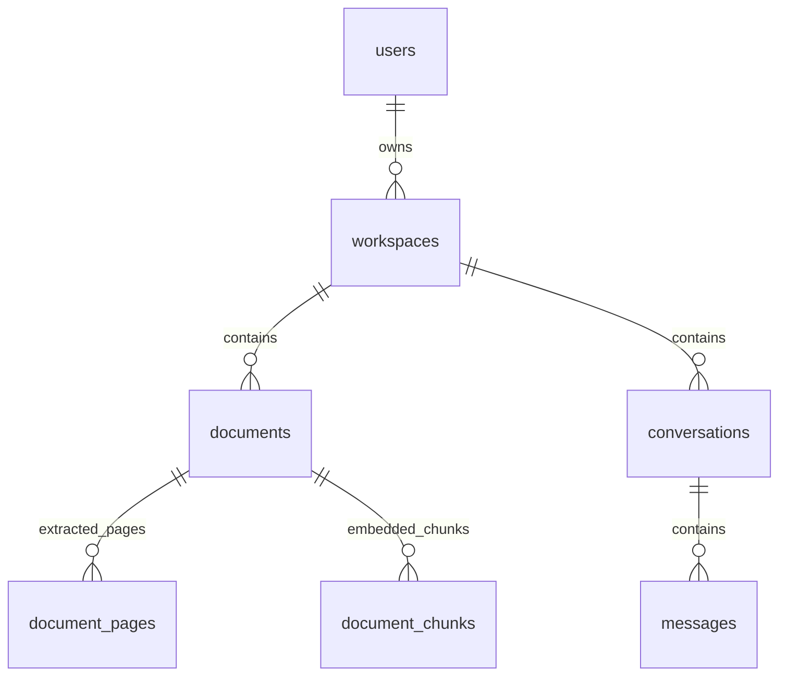

# Schema — tuần 5



| Bảng | Trường ngoài id/created_at | Ràng buộc |
|---|---|---|
| users | email, password_hash | Email unique, chuẩn hóa chữ thường tại API; password_hash dùng Argon2 |
| workspaces | owner_id, name | FK users, index owner_id |
| documents | workspace_id, filename, size_bytes, status, page_count, error_message | FK workspaces, index workspace_id; status uploaded/ready/failed; page_count/error_message nullable |
| document_pages | document_id, page_number, text | Khóa chính ghép document_id + page_number; FK documents ON DELETE CASCADE |
| conversations | workspace_id, title | FK workspaces, index workspace_id |
| messages | conversation_id, role, content | FK conversations, index conversation_id; role user/assistant |

Các bảng ngoài document_pages có UUID primary key và created_at timezone-aware, mặc định thời gian DB. UUID do SQLAlchemy sinh khi ORM insert; raw SQL phải cung cấp id. Các cột index_error/index_job_id/index_started_at/indexed_at/embedding_model trên documents và page_count/error_message có thể NULL. DocumentPage dùng khóa ghép, số trang bắt đầu 1 và không có timestamp riêng. Xóa workspace có tài liệu/hội thoại vẫn bị chặn; API xóa tài liệu tuần 5 dọn file và dùng FK cascade để không để sót pages/chunks.

Message chỉ lưu conversation_id để không có hai workspace_id mâu thuẫn. Truy vấn nội dung lịch sử sau này phải join conversation và kiểm tra workspace/owner. Tuần 3 có auth và kiểm tra owner tại API workspace/danh sách tài liệu/hội thoại; chưa có RLS. Xóa workspace có tài liệu hoặc hội thoại trả 409; FK là lớp chặn bổ sung. Schema không đổi trong tuần 3, không cần migration mới.

ERD báo cáo có document_chunks và task_history. document_chunks được thêm ở tuần 5 với vector 1.024 chiều và metadata trang. task_history và index phục vụ retrieval vẫn là phần sau. Workspace của chunk được xác định qua documents, không lưu workspace_id trùng lặp.

Migration `0001_initial` tạo 5 bảng nền. `0002_pdf_documents` thêm metadata PDF và document_pages, không xóa tài khoản/workspace/tài liệu cũ. Document cũ chưa có file vật lý được đánh dấu failed với lời nhắc tải lại. Kho file lưu riêng ngoài DB dưới backend/storage, không đưa lên Git. Downgrade xóa cấu trúc và dữ liệu liên quan, chỉ dùng trên DB thử nghiệm riêng khi thật sự cần. Sau khi sửa model, tạo migration mới và review trước khi apply:

```powershell
.\.venv\Scripts\python.exe -m alembic revision --autogenerate -m "describe schema change"
.\.venv\Scripts\python.exe -m alembic upgrade head
.\.venv\Scripts\python.exe -m alembic check
```


## Migration 0003_document_vectors

- Extension `vector` trong schema public; Docker server cần cài sẵn pgvector.
- documents thêm index_status (pending/processing/ready/failed), index_error, index_job_id UUID, index_started_at/indexed_at timestamptz, chunk_count, embedding_model. Dữ liệu cũ giữ nguyên, index_status mặc định pending.
- document_chunks: id UUID, created_at, document_id FK CASCADE, chunk_index, page_number, start_char, end_char, text, embedding vector(1024), embedding_model.
- Unique(document_id, chunk_index), index(document_id). Workspace và tên file lấy từ documents; mọi API xác minh owner trước khi trả đoạn. Không tạo FK workspace lặp trong chunks.
- Các vị trí ký tự theo chuỗi Python trên văn bản trang đã trích xuất; start inclusive, end exclusive, không phải byte offset PDF. Chunk không vượt qua ranh giới trang.
- Chưa thêm HNSW, chưa có bảng jobs/queue; claim nằm trong documents, kết quả chunks và trạng thái ready commit cùng nhau.
