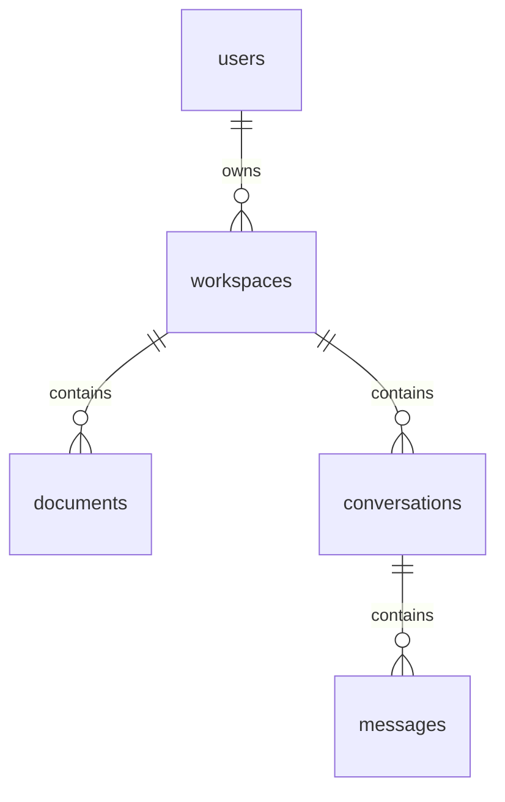

# Schema ban đầu



| Bảng | Trường ngoài id/created_at | Ràng buộc |
|---|---|---|
| users | email, password_hash | Email unique; chưa có chức năng login |
| workspaces | owner_id, name | FK users, index owner_id |
| documents | workspace_id, filename | FK workspaces, index workspace_id |
| conversations | workspace_id, title | FK workspaces, index workspace_id |
| messages | conversation_id, role, content | FK conversations, index conversation_id; role user/assistant |

Mọi bảng có UUID primary key và created_at timezone-aware, mặc định thời gian DB. UUID do SQLAlchemy sinh khi ORM insert, không có default UUID phía DB; raw SQL phải cung cấp id. Các cột trên đều NOT NULL. Xóa bản ghi cha có con bị FK chặn; chưa tự cascade hoặc xóa file. Quy tắc xóa sẽ chốt cùng API tương ứng.

Message chỉ lưu conversation_id để không có hai workspace_id mâu thuẫn. Truy vấn lịch sử phải join conversation và kiểm tra workspace/owner. Không công bố bảo đảm cách ly dữ liệu chỉ nhờ các FK: chưa có auth/API tài nguyên/RLS.

ERD báo cáo có document_chunks và task_history. Hai bảng đó được giữ trong thiết kế tương lai, chưa tạo trong migration tuần 2 để tránh chốt sớm vector/task schema trước giai đoạn tương ứng. pgvector, dimensions, index retrieval, metadata trang và output task chưa triển khai. Khi thêm chunks có cả workspace_id và document_id phải ràng buộc nhất quán với workspace của document.

Migration `0001_initial` tạo bảng theo thứ tự cha → con. Downgrade xóa bảng và dữ liệu, chỉ dùng trên DB thử nghiệm riêng khi thật sự cần. Sau khi sửa model, tạo migration mới và review trước khi apply:

```powershell
.\.venv\Scripts\python.exe -m alembic revision --autogenerate -m "describe schema change"
.\.venv\Scripts\python.exe -m alembic upgrade head
.\.venv\Scripts\python.exe -m alembic check
```
