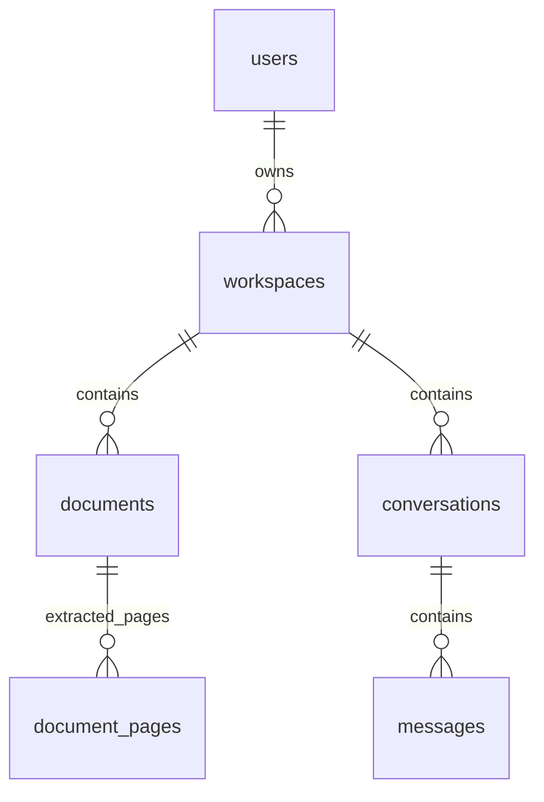

# Schema — tuần 4



| Bảng | Trường ngoài id/created_at | Ràng buộc |
|---|---|---|
| users | email, password_hash | Email unique, chuẩn hóa chữ thường tại API; password_hash dùng Argon2 |
| workspaces | owner_id, name | FK users, index owner_id |
| documents | workspace_id, filename, size_bytes, status, page_count, error_message | FK workspaces, index workspace_id; status uploaded/ready/failed; page_count/error_message nullable |
| document_pages | document_id, page_number, text | Khóa chính ghép document_id + page_number; FK documents ON DELETE CASCADE |
| conversations | workspace_id, title | FK workspaces, index workspace_id |
| messages | conversation_id, role, content | FK conversations, index conversation_id; role user/assistant |

Các bảng ngoài document_pages có UUID primary key và created_at timezone-aware, mặc định thời gian DB. UUID do SQLAlchemy sinh khi ORM insert; raw SQL phải cung cấp id. Các cột NOT NULL trừ page_count/error_message. DocumentPage dùng khóa ghép, số trang bắt đầu 1 và không có timestamp riêng. Xóa workspace có tài liệu/hội thoại vẫn bị chặn; chưa có API xóa tài liệu/file. FK document_pages cascade để không để sót chữ nếu sau này xóa Document.

Message chỉ lưu conversation_id để không có hai workspace_id mâu thuẫn. Truy vấn nội dung lịch sử sau này phải join conversation và kiểm tra workspace/owner. Tuần 3 có auth và kiểm tra owner tại API workspace/danh sách tài liệu/hội thoại; chưa có RLS. Xóa workspace có tài liệu hoặc hội thoại trả 409; FK là lớp chặn bổ sung. Schema không đổi trong tuần 3, không cần migration mới.

ERD báo cáo có document_chunks và task_history. Hai bảng đó được giữ trong thiết kế tương lai, chưa tạo trong migration tuần 2 để tránh chốt sớm vector/task schema trước giai đoạn tương ứng. pgvector, dimensions, index retrieval, metadata trang và output task chưa triển khai. Khi thêm chunks có cả workspace_id và document_id phải ràng buộc nhất quán với workspace của document.

Migration `0001_initial` tạo 5 bảng nền. `0002_pdf_documents` thêm metadata PDF và document_pages, không xóa tài khoản/workspace/tài liệu cũ. Document cũ chưa có file vật lý được đánh dấu failed với lời nhắc tải lại. Kho file lưu riêng ngoài DB dưới backend/storage, không đưa lên Git. Downgrade xóa cấu trúc và dữ liệu liên quan, chỉ dùng trên DB thử nghiệm riêng khi thật sự cần. Sau khi sửa model, tạo migration mới và review trước khi apply:

```powershell
.\.venv\Scripts\python.exe -m alembic revision --autogenerate -m "describe schema change"
.\.venv\Scripts\python.exe -m alembic upgrade head
.\.venv\Scripts\python.exe -m alembic check
```
